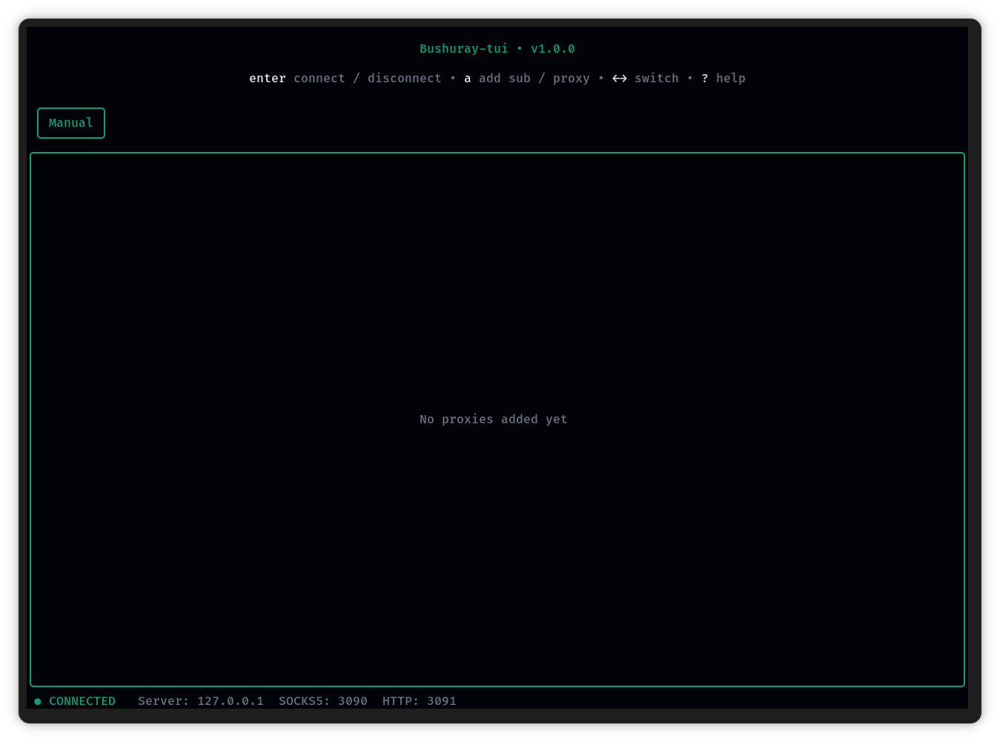

## Bushuray-tui



A keyboard-driven Xray proxy client for the terminal. Built with [bubbletea](https://github.com/charmbracelet/bubbletea) and powered by [Bushuray-core](https://github.com/amirhosseinkhorshidi/Bushuray-core).

## Installation

Download and extract the latest release from the [releases page](https://github.com/amirhosseinkhorshidi/Bushuray-tui/releases), then move the folder to `/opt`:

```bash
unzip *.zip
sudo mv bushuray /opt/bushuray
```

**zsh** — add to PATH in `~/.zshrc`:

```bash
echo 'export PATH="/opt/bushuray:$PATH"' >> ~/.zshrc
source ~/.zshrc
```

**bash** — add to PATH in `~/.bashrc`:

```bash
echo 'export PATH="/opt/bushuray:$PATH"' >> ~/.bashrc
source ~/.bashrc
```

Then run from anywhere:

```bash
bushuray
```

If you prefer not to modify your shell config, you can run the binary directly — but you **must** be inside the `/opt/bushuray` directory first:

```bash
cd /opt/bushuray
./bushuray
```

`bushuray-core` is looked up in the following order:

1. `$PATH` (system path)
2. Same directory as the `bushuray` executable (`/opt/bushuray/`)
3. `./bushuray-core`
4. `./bin/bushuray-core`
5. `/usr/bin/bushuray-core`
6. `/usr/local/bin/bushuray-core`

## Keybindings

| Key | Action |
|---|---|
| `enter` | Connect / disconnect |
| `a` | Add subscription or proxy |
| `t` | Test current proxy |
| `T` | Test all proxies in subscription |
| `U` | Update subscription |
| `d` / `del` | Delete proxy |
| `D` | Delete subscription |
| `C` | Change theme |
| `↑↓` | Navigate |
| `←→` | Switch subscription tab |
| `q` | Exit |
| `?` | Help menu |

## Themes

| Name | Description |
|---|---|
| Ember | burn it down |
| Wine | pour me another |
| Copper | forge and fire |
| Sunset | golden hour forever |
| Neon | too bright to ignore |
| Matrix | hack the planet |
| Teal | calm runs deep |
| Cyan | electric ice |
| Ocean | deep and cold |
| Indigo | between worlds |
| Nebula | lost in space |
| Sakura | soft but deadly |
| Silver | cold steel |

Press `C` to cycle through themes. The selected theme is saved to config automatically.

## Configuration

Config is stored at `~/.config/bushuray/config.json` and created automatically on first run.

```json
{
  "socks-port": 3090,
  "http-port": 3091,
  "core-tcp-port": 4897,
  "test-port-range": {
    "start": 3095,
    "end": 30120
  },
  "no-background": false,
  "theme": "Matrix"
}
```

| Field | Default | Description |
|---|---|---|
| `socks-port` | `3090` | Local SOCKS5 proxy port |
| `http-port` | `3091` | Local HTTP proxy port |
| `core-tcp-port` | `4897` | Port used to connect to `bushuray-core` |
| `test-port-range` | `3095–30120` | Port range used for latency testing |
| `no-background` | `false` | Disable background color (useful for transparent terminals) |
| `theme` | `Matrix` | Active theme name |

## Updating Xray

The Xray binary is located at `/opt/bushuray/bin/xray`. To update:

```bash
# Check latest version
curl -s https://api.github.com/repos/XTLS/Xray-core/releases/latest | grep tag_name

# Download and replace (update version number accordingly)
wget https://github.com/XTLS/Xray-core/releases/download/vX.X.X/Xray-linux-64.zip
unzip Xray-linux-64.zip
sudo cp xray /opt/bushuray/bin/xray
sudo chmod +x /opt/bushuray/bin/xray
```

## Debugging

```bash
tail -f /tmp/bushuray-debug.log       # TUI logs
tail -f /tmp/bushuray-core-debug.log  # bushuray-core logs
```
